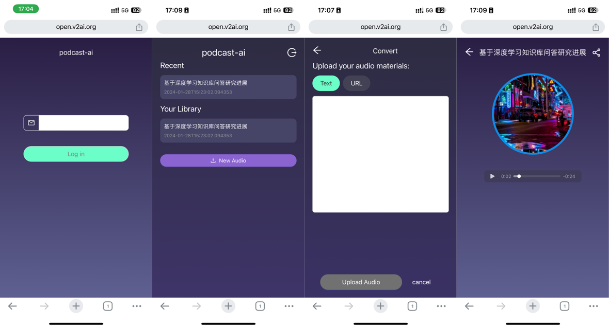

# Podcast AI

Whether it’s text or a link, it can be turned into a podcast!

[English | [中文](./README_CN.md)]



## Getting start

### 1 use docker compose (recommend)

```bash
vim ./backend/conf/default.yaml
# add openai api_key

docker compose up
# open http://127.0.0.1:3000
```

### 2 use docker

```bash
# run backend
cd backend

vim ./conf/default.yaml
# write openai api_key

docker build -t podcast-ai-backend .
docker run -d --name podcast-ai-backend \
  -v $PWD/conf/:/app/conf/ \
  -v $PWD/data/:/app/data/ \
  -p 9999:9999 podcast-ai-backend

docker logs -f podcast-ai-backend

# run frontend (open another terminal)
cd frontend

docker build -t podcast-ai-frontend .
docker run -d --name podcast-ai-frontend \
  -p 3000:3000 podcast-ai-frontend

docker logs -f podcast-ai-frontend
# open http://127.0.0.1:3000
```

### 3 bare metal

```shell
# run backend
cd backend

vim ./conf/default.yaml
# write openai api_key

# python3.9 is required!
pip install -r requirements.txt

python -m server.main

# run frontend (open another terminal)
cd frontend

# node.js v18 is required!
npm install

npm run dev
# open http://127.0.0.1:3000
```

## Technology


## Reference

- [FastAPI](https://fastapi.tiangolo.com/)
- [Next.js](https://nextjs.org/)
- [Ant Design](https://ant.design/)
- [Langchain](https://www.langchain.com/)

## License

[MIT](./LICENSE)
