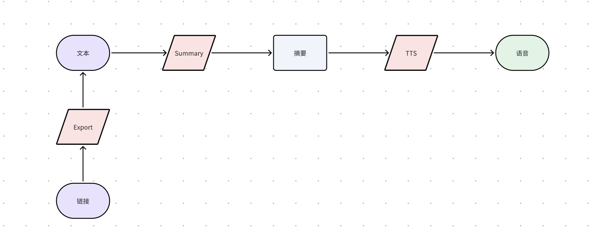

# Podcast AI

不管是文本还是链接，都能变成播客！

[[English](./README.md) | 中文]


## 快速上手 

### 1 使用 docker compose 快速运行（推荐）

```bash
vim ./backend/conf/default.yaml
# 添加 openai api_key

docker compose up
# 打开 http://127.0.0.1:3000
```

### 2 使用 docker 运行

```bash
# 运行后端
cd backend

vim ./conf/default.yaml
# 添加 openai api_key

docker build -t podcast-ai-backend .
docker run -d --name podcast-ai-backend \
  -v $PWD/conf/:/app/conf/ \
  -v $PWD/data/:/app/data/ \
  -p 9999:9999 podcast-ai-backend

docker logs -f podcast-ai-backend

# 打开一个新窗口，运行前端
cd frontend

docker build -t podcast-ai-frontend .
docker run -d --name podcast-ai-frontend \
  -p 3000:3000 podcast-ai-frontend

docker logs -f podcast-ai-frontend
# 打开 http://127.0.0.1:3000
```

### 3 裸机快速启动

```shell
# 运行后端
cd backend

vim ./conf/default.yaml
# 添加 openai api_key

# 需要 Python 版本大于等于 3.9！
pip install -r requirements.txt

python -m server.main

# 打开一个新窗口，运行前端
cd frontend

# 需要 node.js 版本大于等于 18！
npm install

npm run dev
# 打开 http://127.0.0.1:3000
```

## 技术介绍




## 参考 

- [FastAPI](https://fastapi.tiangolo.com/zh/)
- [Next.js](https://nextjs.org/)
- [Ant Design](https://ant.design/)
- [Langchain](https://www.langchain.com/)

## 协议

[MIT](./LICENSE)
